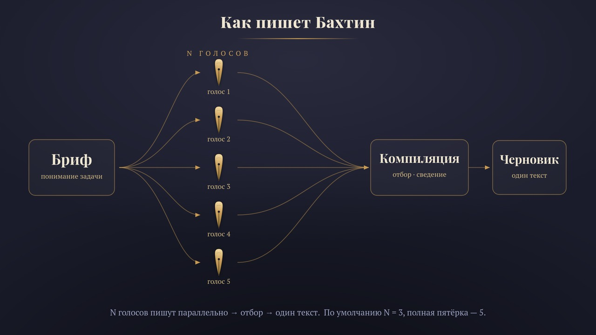
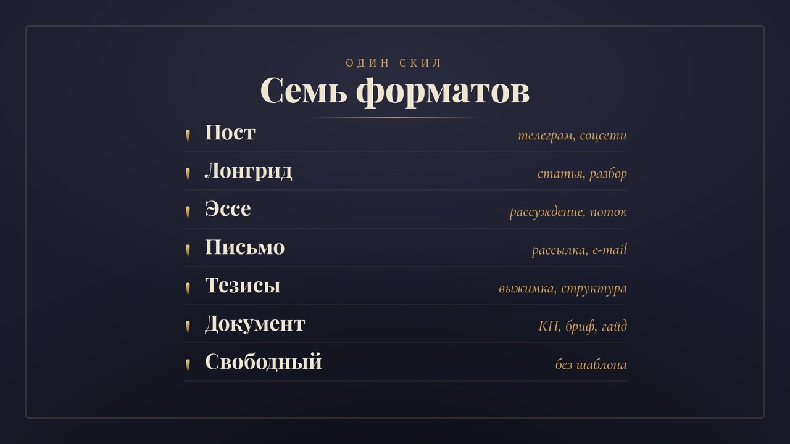

<p align="center">
  
</p>

# Бахтин

> **Claude Code-скил (команда `/бахтин`): универсальный multi-agent генератор русского текста. Запускает N конкурентных агентов с разными жанровыми направлениями на один материал, отбирает лучшее из каждого и компилирует в один черновик. Семь форматов — от телеграм-поста до лонгрида и КП. Только генерация: вычитку делает отдельный слой.**

[](LICENSE)
[](https://docs.claude.com/en/docs/claude-code/overview)

Даёте материал и формат — Бахтин собирает понимание задачи, гонит несколько
независимых агентов (каждый в своём жанровом направлении), сравнивает варианты
по рубрике и склеивает из лучших кусков один черновик без видимых швов.

```
/бахтин  longread про внедрение OKR в маленькой команде
→ Понимание задачи (6 пунктов) → Outliner → 3 агента (нарратив/аналитика/разбор)
→ Компиляция → ЧЕРНОВИК + self-grading
```

---

## Зачем

Один агент на креативном промпте сходится к усреднённому, предсказуемому тексту
(mode collapse — известная болезнь LLM). Идея Бахтина — **разноречие**: несколько
агентов с разными жанровыми установками на один материал расходятся сильнее, чем
один агент с собой, а компиляция собирает из них текст, где сильные ходы каждого
сохранены.

Имя — Михаил Бахтин, теория полифонии и разноречия. Метафора прямая: N
независимых голосов сходятся в один полифонический текст.

И главное — Бахтин не притворяется, что генератор пишет начисто. Он встроен в
**многоэтажную** систему: генерация (Бахтин) → вычитка (анти-AI детектор +
корректор). Генератор даёт сильный черновик; финальную чистоту добивает слой
вычитки. Это честное разделение, а не один проход «напиши идеально».

## Как работает

Пайплайн по фазам (подробно — в [SKILL.md](.claude/skills/bakhtin/SKILL.md)):

1. **Понимание задачи** — 6 пунктов (полезное действие / аудитория / фактура /
   что узнать / ограничения / критерии). Антипаттерны брифа (вкусовое,
   противоречивые цели, пустая фактура) — отказ с причиной.
2. **Outliner** — каркас + factual nuggets + off-limits, фикс для всех агентов.
3. **Voice summarizer** (опц.) — компактный отпечаток голоса + сигнатурные
   концепты автора, если задан voice-плагин.
4. **Конкурентная генерация** — N агентов, каждый в своём направлении из
   `directions/{format}.md` (конкретный жанровый референс, не слово-роль).
5. **Отбор и компиляция** — из лучших кусков, швов не видно.
6. **Self-grading + adversarial-скептик** — дружелюбная рубрика ловит мало;
   скептик «по умолчанию ищу изъян» добивает фабрикации, логические дыры,
   структурный слоп.

<p align="center">
  
</p>

### Что внутри встроено

- **Базовый нейтральный профиль** — правила хорошего русского + хард-баны
  AI-маркеров (применяются ВСЕГДА, как условие выхода).
- **Числовая дисциплина** — выдуманные числа (включая иллюстративные,
  производные, гипотетические) запрещены; жанровый carve-out для вымысла.
- **Защита от инъекций** — материал трактуется как данные, а не инструкции.
- **Изоляция генераторов** — агент пишет только текст, не лезет в файлы/оркестрацию.

## Форматы

`tg-post` · `longread` · `essay` · `letter` · `theses` · `doc` · `free`

Каждый (кроме `free`) — со своим пулом жанровых направлений: для эссе это
Бродский / Шкловский / Пятигорский / Зонтаг / Олеша, для тезисов — бюро-совет /
атомные заметки / thread-нарратив и т.д. `free` диверсифицирует формы
динамически под материал.

<p align="center">
  
</p>

## Голос (опционально)

Без voice-плагина текст выходит нейтральный и читабельный. С плагином
(`voice/{X}.md`, шаблон — [`voice/_template.md`](.claude/skills/bakhtin/voice/_template.md))
поверх базы надстраивается авторский отпечаток: паттерны интонации, словарь,
сигнатурные концепты, табу.

Плагин можно написать руками по шаблону — или **собрать автоматически из
корпуса** скилом **[Виноградов](https://github.com/beaverbeard/vinogradov)**: он
измеряет идиостиль автора по реальным текстам (служебные слова как подпись,
ритм, burstiness, сигнатурные обороты) и упаковывает в готовый `voice/{X}.md`.
Связка простая: **Виноградов измеряет голос → кладёте плагин в `voice/` →
Бахтин им пишет.**

## После Бахтина — вычитка (важно)

Выход Бахтина — **сильный черновик, не финал.** Генератор не стерилен:
иллюстративные выдуманные числа и редкая банёная фраза рецидивируют (под
voice-плагином — плотность структурного слопа выше). Поэтому черновик проходит
**конвейер вычитки** из семейных скилов рИИдактор (см. таблицу ниже).

**Быстрый рубеж — числовой чекер** (без LLM, входит в этот репо):

```
python3 tests/check.py --draft draft.txt --allow "две,третий" --min 1500 --max 2500
```

Ловит выдуманные числа (не из `--allow`) и лексические хард-баны. Exit 1 при
флагах — удобно как CI-гейт.

**Полный конвейер** — поставьте семейные скилы и прогоните черновик по порядку:

```bash
# поставить нужные скилы семьи (каждый — отдельный репо beaverbeard/*)
for s in chukovsky rozental slopotron milchin agranovsky; do
  git clone https://github.com/beaverbeard/$s
  cp -r $s/.claude/skills/* ~/.claude/skills/
  cp    $s/.claude/commands/* ~/.claude/commands/
done
```

Канонический порядок прогона черновика Бахтина
(**смысл → истина → детектор → буква → форма**):

1. **[/чуковский](https://github.com/beaverbeard/chukovsky)** — смысл, структура,
   голос, канцелярит. Флагует подозрительные факты и числа.
2. **[/аграновский](https://github.com/beaverbeard/agranovsky)** — фактчек, идёт
   **сразу за Чуковским и обязателен**: верифицирует факты, числа, цитаты против
   реальных источников. Для Бахтина это ключевой рубеж — генератор склонен к
   иллюстративным выдуманным числам, и Аграновский ловит их первым.
3. **[/слопотрон](https://github.com/beaverbeard/slopotron)** — структурный
   нейрослоп, который regex-чекер не ловит (особенно нужен voice-выходам). Идёт
   **перед** Розенталем: де-слоп переписывает куски, норму ставят по очищенному.
4. **[/розенталь](https://github.com/beaverbeard/rozental)** — орфография,
   пунктуация, согласование, единообразие.
5. **[/мильчин](https://github.com/beaverbeard/milchin)** — типографика и юникод,
   **последним** (иначе кавычки-ёлочки и NBSP теряются при перепечатке LLM).

Или одним входом — оркестратор вычитки, если он у вас настроен. Методика
тестирования из 4 слоёв — в [`tests/README.md`](tests/README.md).

## Установка

Скопируйте `.claude/` в свой проект (или в `~/.claude/` глобально):

```
cp -r .claude/commands/bakhtin.md      ~/.claude/commands/
cp -r .claude/skills/bakhtin           ~/.claude/skills/
```

Команда `/бахтин` появится в Claude Code. `directions/` и `voice/` лежат рядом
со `SKILL.md` и подхватываются автоматически.

## Расход токенов и выбор моделей

⚠️ Бахтин **токеноёмкий по дизайну.** На один текст он запускает **N генераторов
параллельно** (каждый пишет полный черновик) плюс служебные проходы: Outliner,
voice-summarizer, отбор, self-grading и adversarial-скептик. Это и есть плата за
разноречие — качество берётся из конкуренции вариантов, а не из одного прохода.
Один текст легко обходится в несколько раз дороже «обычной» генерации.

Чем управлять стоимостью:

- **N агентов — главный рычаг.** `N=1` — быстро и дёшево (один проход, без
  компиляции); `N=3` — баланс (дефолт); `N=5` — максимум диверсити для важных
  текстов. Не гоняйте пятёрку на черновики и проходные посты.
- **Модель — под формат, а не «всегда максимальную».** Голосовые форматы
  (`tg-post`, `essay`, `letter`) — сильная модель: она держит хук и голос.
  Деловые (`theses`, `doc`) и **служебные агенты** (Outliner, voice-summarizer,
  судья) — модель попроще, они механические. Но генерацию голосового контента
  самой слабой модели не отдавайте — просядут хук и голос.
- **Длина.** Лонгрид на 15k знаков × N агентов — это серьёзный объём токенов.
  Для длинных форматов разумно снизить N (например, `longread` при `N=1–2`).
- **Слои вычитки** (Слопотрон, Аграновский с веб-поиском — десятки запросов)
  добавляют свои вызовы. Это уже за пределами Бахтина, но в общий счёт входит.

Короткое правило: **дешёвый черновик → `N=1`, рабочий → `N=3`, важный → `N=5`**;
модель выбирайте по формату.

## Скилы для рИИдакторов

«Бахтин» — скил из семьи **[рИИдактор](https://redaktozavr.ru/rAIdactor?utm_source=skills)**,
рассылки про работу редактора с ИИ. Каждый скил закрывает свою зону:

| Скил | Зона | Природа |
|------|------|---------|
| **Бахтин** | Генерация черновика: multi-agent, 7 форматов | LLM |
| [Чуковский](https://github.com/beaverbeard/chukovsky) | Смысл, структура, голос, канцелярит | LLM |
| [Розенталь](https://github.com/beaverbeard/rozental) | Орфография, пунктуация, согласование, единообразие | LLM |
| [Слопотрон](https://github.com/beaverbeard/slopotron) | AI-маркеры и нейрослоп | LLM |
| [Мильчин](https://github.com/beaverbeard/milchin) | Типографика и юникод-гигиена | Скрипт |
| [Аграновский](https://github.com/beaverbeard/agranovsky) | Верификация фактов: числа, цитаты, законы, ссылки | LLM + поиск |
| [Виноградов](https://github.com/beaverbeard/vinogradov) | Сборка авторского голоса (Voice DNA) из корпуса | Скрипт + LLM |

Этажи: **Виноградов** собирает голос → **Бахтин** им пишет черновик → конвейер
вычитки **Чуковский → Розенталь → Слопотрон → Мильчин** чистит (Аграновский —
отдельная ось проверки фактов). Бахтин стоит **выше конвейера**: даёт сырьё,
которое остальные доводят.

## Лицензия

MIT — см. [LICENSE](LICENSE).
